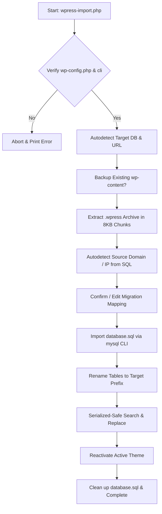

# WordPress Standalone `.wpress` CLI Importer & Migrator

[](https://opensource.org/licenses/MIT)
[](https://www.php.net/)
[]()
[_Footprint-orange.svg)]()

A high-performance, robust, standalone command-line utility to extract and import `.wpress` archives of arbitrary sizes.

Unlike traditional web-based plugins that crash on large archives due to HTTP timeout limits (`max_execution_time`) or memory exhaustion (`memory_limit`), this script drops into your WordPress root directory, operates in pure CLI mode, and handles files up to **10GB+** with a constant, low-memory footprint.

---

## 🚀 Key Features

*   📦 **Zero PHP Web Limits**: Runs directly in the CLI, bypassing web server execution timeouts and high web-worker overhead.
*   💾 **O(1) Constant Memory Footprint**: Extracts files in streaming 8KB chunks and processes database search-and-replace using a 1,000-row paginated cursor loop.
*   🔍 **Smart Autodetection (Domains & IPs)**: Scans the target database and the extracted SQL dump to discover old/new URLs, absolute paths, and prefix overrides.
*   🌐 **Raw IP & Custom Port Support**: Fully supports migration paths using raw IP addresses (e.g., staging servers at `http://192.168.1.100` or `http://12.34.56.78:8080`) and custom ports.
*   🔒 **Serialized-Safe Database Replacements**: Performs deep, recursive replacements that correctly rewrite PHP-serialized arrays and JSON strings (essential for page builders like Elementor, Divi, and Beaver Builder).
*   🧪 **Simulation Mode (`--dry-run`)**: Test and preview the entire extraction, database scanning, and mapping process without writing any files or altering a single row.
*   🎨 **ANSI Color CLI Interface**: Beautifully formatted terminal outputs, visual loaders, and interactive confirmation menus.

---

## ⚙️ How It Works

The script operates through a clean, multi-stage pipeline designed for safety and speed:



---

## 📋 Requirements

*   **PHP**: Version 7.0 or higher.
*   **Extensions**: `mysqli` must be enabled.
*   **Environment**: Command-line interface access (SSH/Local Terminal).
*   **Database CLI Utilities**: Standard `mysql` command-line utility installed on the system (for fast, safe SQL imports).
*   **WP-CLI (Optional)**: Automatically detected and used if available for native WordPress search-and-replace operations.

---

## ⚡ Quick Start Guide

### Step 1: Download and Place the Script
Navigate to the root directory of your target WordPress installation (where `wp-config.php` lives) and download the `wpress-import.php` script directly from GitHub.

#### Option A: Download via Terminal (Recommended)
You can download the script directly to your server in one second using `curl` or `wget`:

```bash
# Navigate to your WordPress root directory
cd /var/www/html/my-wordpress-site/

# Download using curl
curl -O https://raw.githubusercontent.com/ErickMSDev/wpress-cli-importer/main/wpress-import.php

# OR download using wget
wget https://raw.githubusercontent.com/ErickMSDev/wpress-cli-importer/main/wpress-import.php
```

#### Option B: Manual Download
1. Download `wpress-import.php` from this repository.
2. Upload it to the root of your WordPress folder using FTP, SFTP, or your hosting control panel.

Make sure your backup `.wpress` file is also uploaded to the same directory (or know its absolute path).


### Step 2: Run a Simulation (Recommended)
Before changing any files, execute a dry run to verify the archive's contents, connection parameters, and autodetected URLs.

```bash
php wpress-import.php my-backup.wpress --dry-run
```

### Step 3: Execute the Migration
Run the script to start the extraction and interactive database mapping process.

```bash
php wpress-import.php my-backup.wpress
```

---

## 🛠️ CLI Arguments & Commands

```bash
php wpress-import.php <archive-file.wpress> [options]
```

### Options

| Option | Description |
| :--- | :--- |
| `--dry-run` | Runs in **Simulation Mode**. Parses headers, counts files, performs in-memory URL analysis on `database.sql`, and outputs mapping summaries without modifying files or database tables. |

---

## 💡 Migration Scenarios Covered

### 1. Standard Domain Migration
*   **Old URL**: `https://shop.productiondomain.com`
*   **New URL**: `https://shop.newproduction.com`
*   Replaces absolute paths and domains securely.

### 2. Bare IP / Staging Migrations
*   **Old URL**: `http://192.168.1.50`
*   **New URL**: `http://104.24.12.9:8080`
*   The script adapts regex bounds to make sure numeric IP blocks and specific port markers do not break the database structure.

### 3. Localhost / Docker Development
*   **Old URL**: `https://production.com`
*   **New URL**: `http://localhost:8888`
*   Perfect for pulling live backups down to local development environments.

---

## 🔒 Security Best Practices

> [!WARNING]
> Because this script requires access to your `wp-config.php` and target database, it is extremely powerful.
>
> 1. **Do not run this script on an unprotected HTTP request.** The script contains a native SAPI check (`php_sapi_name() !== 'cli'`) that restricts execution solely to the command line, preventing remote malicious web execution.
> 2. **Delete the script immediately after migration.** Once the migration completes successfully, delete `wpress-import.php` from your root folder:
>    ```bash
>    rm wpress-import.php
>    ```

---

## 📄 License

This project is licensed under the MIT License - see the [LICENSE](LICENSE) file for details.

---

### 👨‍💻 Created by [ErickMSDev](https://github.com/erickmsdev)
*Feel free to star the repository if this tool saved your WordPress migrations!*
